<p align="center">
  <a href="https://github.com/katoptra">
    <picture>
      <source media="(prefers-color-scheme: dark)" srcset="https://katoptra.org/brand/katoptra-mark-dark-224.png">
      
    </picture>
  </a>
</p>

<h1 align="center">dropbox</h1>

<p align="center">A nightly mirror of a Dropbox account into Proton Drive.</p>

<p align="center">
  <a href="https://github.com/katoptra/dropbox/actions/workflows/sync.yml"></a>
  <a href="LICENSE"></a>
  <a href="https://github.com/katoptra/dropbox/actions/workflows/sync.yml"></a>
</p>

A nightly, self-chaining mirror of a Dropbox account into one Proton Drive folder. After
each run Proton Drive holds what Dropbox held at listing time. Changed files become new
Proton revisions, files that left Dropbox move to Proton's trash, and nothing is recorded
as mirrored until Proton's own upload summary has accounted for it. The only durable
state is one SQLite database, age-encrypted in a bucket; no run is ever told where to
start. Dropbox stays the primary; nothing written in Proton Drive flows back.

The repository is public and holds no account: every credential and every account
identifier lives in one vault and reaches a run by name. The infrastructure modules under
`src/migrator/` (the SQLite evidence schema, the one-pass hasher, atomic writes, the
redacting logger, path guards, and the two providers for the Dropbox API and the
`proton-drive` CLI) come from
[donphi/dropbox_proton](https://github.com/donphi/dropbox_proton) at commit `cfd0e57`,
MIT, whose copyright notice is retained in [LICENSE](LICENSE). The mirror phases and the
Taskfile are this repository's own.

## How to use

The files are under the destination folder in Proton Drive, at their Dropbox paths and
with Dropbox's casing. An edit in Dropbox is a new revision in Proton the next morning;
a delete is in Proton's trash; a file too large for the runner to stage is counted as
oversized in the run's report and can be uploaded by hand to its Dropbox path, where the
weekly walk leaves it alone.

## How it works

Once a night a GitHub Actions job runs this pipeline inside the toolbox image from
[katoptra/lib](https://github.com/katoptra/lib). The toolbox's own verbs are the solid
boxes; every dashed box is one `python -m migrator <command>`. This mirror includes the
toolbox alone and supplies its own pipeline: the Taskfile owns the order, the Python
owns every decision.

```mermaid
flowchart LR
  clock --> cp["clock"] --> session --> state --> inventory --> delta --> plan --> batches
  subgraph b["batches: each until the run's budget"]
    direction LR
    fetch --> verify --> upload --> confirm --> checkpoint
  end
  batches --> b --> trash --> reconcile["reconcile<br/>weekly"] --> rp["report"] --> report --> ping
  classDef own stroke-dasharray: 5 5
  class cp,session,state,inventory,delta,plan,batches,fetch,verify,upload,confirm,checkpoint,trash,reconcile,rp own
```



| Step | Does |
|---|---|
| `clock` | The migrator's own stamp after the toolbox's: the run's start to `.run/clock.json`; clears staging, the report and the chain marker |
| `session` | Fetches the encrypted Proton CLI session from the bucket and unpacks it for every later CLI call |
| `state` | Fetches the state database and starts the run row. A missing state is accepted as an empty mirror only when the history is empty too; a missing state beside history is refused, because a lost state must never look like an empty mirror |
| `inventory` | Walks Dropbox over the API, each page committed with its cursor. Entries with no content hash are recorded as non-downloadable and excluded. Display paths are rebuilt from each ancestor's own name, because Dropbox cases parent segments inconsistently |
| `delta` | Compares the inventory against `mirror_objects` on path, size and content hash. Refuses a listing under half the mirrored file count, so a truncated listing can never become a trash list |
| `plan` | Refuses a tree over `ceiling_gb` or a batch the disk cannot stage. Leaves out files over `max_file_gb` and counts them as oversized. Packs the rest into batches of `batch_gb` and `batch_files` |
| `batches` | Runs each batch through the five steps below, stopping before a batch that would pass the run's budget; stopping with batches left is a success that chains the next run |
| `fetch` | Downloads the batch from Dropbox into staging under its display paths; a path that vanished since listing is counted and skipped |
| `verify` | Recomputes every staged file's Dropbox content hash and records SHA-1 and SHA-256. A mismatch is a file edited since listing: removed and counted, never recorded |
| `upload` | One `proton-drive filesystem upload` of the staging tree; Proton skips files whose content it already holds and makes revisions of changed ones |
| `confirm` | The upload summary must account for every verified file plus every folder, and every failure must name a file in the batch. Those alone are recorded as failed; the rest confirm |
| `checkpoint` | Merges the confirmed rows into `mirror_objects` and pushes the state to the bucket, a dated copy first and then the canonical key. Always the last step of a batch, so a killed run repeats at most one |
| `trash` | Only when every planned batch landed. A topmost folder the mirror holds nothing live under goes in one `filesystem trash` call, subtree and all; a folder still holding live files gets its deleted files trashed by name, 50 paths per call. Each unit's `mirror_objects` rows are dropped as it lands. Checkpoints every 50 units, stops at the run budget and chains the next run for the rest |
| `reconcile` | On the first run of the configured weekday, or with `RECONCILE=true`: a full Proton walk compared against `mirror_objects`. Rows Proton lacks or mis-sizes are dropped so they re-upload; nodes neither Dropbox nor the state knows are trashed. A walk that does not fit one run resumes on the next, and a partial walk drops and trashes nothing |
| `report` | Builds the step summary from the state alone, finishes the run row, writes the chain marker, and returns the run's status |

Every step is plan-by-default: `batches`, `trash`, `reconcile`, `report` and
`empty-trash` change anything only with `--apply`, which `task pipeline` passes and
`task plan-pipeline` never does. No mutation is trusted on its exit status. The evidence
has three layers: the upload summary per batch, matched item by item; Proton's own
server-side block hashes, checked at upload and out of this repository's hands; and the
weekly walk, which compares Proton's own listing against the state independently of
anything a batch claimed.

The run around those steps, from the image and the secrets to the report and the ping,
is the toolbox's and is documented once in
[lib's README](https://github.com/katoptra/lib#the-toolbox).

## Want your own?

### 1. Fork it

Fork [katoptra/dropbox](https://github.com/katoptra/dropbox). Nothing in `Taskfile.yml`
names an account; [`config/mirror.toml`](config/mirror.toml) is the one behaviour input
and its defaults fit a GitHub runner. The account is the environment, all of it `op.env`.

### 2. Storage

The bucket holds the state and the session, nothing of the mirrored tree.

```
.state/state.sqlite.xz.age                     the state: evidence tables, mirror_objects, runs, batches, deletions
.state/history/<epoch>-<label>.sqlite.xz.age   one copy per checkpoint; label is the batch number, trash or trash-<folders>, reconcile or report
.state/session.tar.age                         the Proton CLI session; no history, a stale copy cannot be restored
```

| What | Why |
|---|---|
| An R2 bucket, or any S3-compatible bucket | The state and the session |
| An API token with Object Read & Write, scoped to that bucket | The `r2` values in step 3 |
| A lifecycle rule expiring `.state/history/` after 7 days | The bucket has no object versioning; the dated copies are the rollback |

The state holds every mirrored path name, which is why it is encrypted. What the toolbox
and the engines keep in a bucket: [lib, Storage](https://github.com/katoptra/lib#storage).

### 3. Secrets

Twelve values, in one vault item named `dropbox`, one section per service:

| Section | Field | What it is | Reaches the run as |
|---|---|---|---|
| `dropbox` | `app_key`, `app_secret` | The scoped app, step 4 | `MIRROR_DROPBOX_APP_KEY`, `MIRROR_DROPBOX_APP_SECRET` |
| `dropbox` | `refresh_token` | Its permanent token | `MIRROR_DROPBOX_REFRESH_TOKEN` |
| `dropbox` | `account_id` | The `dbid:...` the run must be reading | `MIRROR_DROPBOX_ACCOUNT_ID` |
| `proton` | `destination` | The CLI path of the folder, `/my-files/Dropbox` | `MIRROR_PROTON_DESTINATION` |
| `proton` | `destination_uid` | That folder's UID | `MIRROR_PROTON_DESTINATION_UID` |
| `r2` | `access_key_id`, `secret_access_key` | The token from step 2 | `AWS_ACCESS_KEY_ID`, `AWS_SECRET_ACCESS_KEY` |
| `r2` | `endpoint` | `https://<account-id>.r2.cloudflarestorage.com` | `AWS_ENDPOINT_URL_S3` |
| `r2` | `bucket` | The bucket's name | `MIRROR_R2_BUCKET` |
| `age` | `identity` | An `AGE-SECRET-KEY-...` line from `age-keygen` | `MIRROR_AGE_IDENTITY` |
| `healthcheck` | `url` | Optional: a healthchecks.io ping URL | `HEALTHCHECK_URL` |

Put your vault's UUID into the references in [`op.env`](op.env), make a service account
that can read that vault, and store its token as the `OP_SERVICE_ACCOUNT_TOKEN` secret,
on the organization or on the repository. Finding a vault's UUID and why a UUID and not
a name: [lib, Secrets](https://github.com/katoptra/lib#secrets).

### 4. Dropbox and Proton

**The Dropbox app.** At https://www.dropbox.com/developers/apps create a Scoped access,
Full Dropbox app with only `files.metadata.read` and `files.content.read`; the mirror
can never write to Dropbox. Then a refresh token, which never expires or rotates, and
the account id, which every run checks before trusting a listing:

```sh
# 1. approve, with your key filled in, and copy the code:
#    https://www.dropbox.com/oauth2/authorize?client_id=APP_KEY&response_type=code&token_access_type=offline
curl https://api.dropboxapi.com/oauth2/token -d code=THE_CODE -d grant_type=authorization_code -u APP_KEY:APP_SECRET
# 2. the refresh_token from that response is the vault field; mint an access token from it and ask who you are:
curl https://api.dropboxapi.com/oauth2/token -d grant_type=refresh_token -d refresh_token=REFRESH_TOKEN -u APP_KEY:APP_SECRET
curl -X POST https://api.dropboxapi.com/2/users/get_current_account -H "Authorization: Bearer ACCESS_TOKEN"
# 3. the whole dbid:... string is account_id
```

**The session.** The Proton CLI can only be seeded by a browser sign-in, so the session
is made once on a laptop and carried to every run encrypted; the commands, the folder and
its UID, and `task session-seal -- .run/pd` are in
[lib, The session](https://github.com/katoptra/lib#the-session). Turn telemetry off in
Proton's account settings first. Store the folder's CLI path as `destination` and its
`uid` from the listing as `destination_uid`. This mirror's session is its own.

### 5. Prove it, run it, schedule it

On a laptop with go-task, the 1Password CLI and Docker or Apple `container`:

```sh
task test      # the pytest suite, offline, inside the image
task check     # every pipeline command rendered inside the image, diffed against render.txt
task plan      # the real thing, read-only: the state, the Dropbox listing, the plan it would move
```

Then Actions, sync, Run workflow. The first run finds no state and no history, treats
the whole tree as the delta, and chains itself run after run until the tree is mirrored:
each run stops starting batches at its budget, checkpoints what landed, and queues the
next. The default budget is 335 minutes under a 355-minute job timeout, just under
GitHub's six-hour limit, because every run pays one image pull and one listing. A
200,000-file tree is about 45 hours, roughly sixteen chained runs.

Nothing in this repository schedules a run: add a `schedule:` trigger to
`.github/workflows/sync.yml`, or dispatch it from outside as this mirror is. A scheduled
run queues behind a chained one. After three green nights, edit one file and delete one
in Dropbox and confirm both appear in Proton the next morning.

## Operating it

`task` alone prints the menu, grouped by effect. Everything runs inside the toolbox.

```sh
task plan                          # read-only: the state, the listing, what a sync would move
task status                        # counts and the last run's figures from the state in the bucket
task test && task lint             # pytest; ruff check and format check
task sync                          # one budgeted run, the same thing Actions runs
task sync -- RUN_BUDGET_MIN=30     # a shorter budget
task sync -- RECONCILE=true        # force the weekly Proton walk (the literal word true)
task state-rollback                # list the dated history objects
task state-rollback -- <key>       # copy one of them over the canonical state
task session-seal -- .run/pd       # encrypt a laptop Proton CLI session into the bucket
task empty-trash                   # permanently delete Proton's trash; asks first; never scheduled
```

Never run `task sync` or `task empty-trash` from a laptop while an Actions run may be in
progress: both hold the one Proton session. `task sync` from a laptop is exactly one
chained run, and the next one, wherever it runs, picks up from the state in the bucket.

**Reading a run.** The step summary is built from the state alone, so `task status` on a
laptop shows the same figures as the Actions page, and it carries counts only, never a
path name: mirror status (inventory, mirrored, percent, oversized, batches and runs
remaining); this run (budget used, batches, files fetched, vanished, mismatched,
uploaded, skipped, confirmed, trashed); throughput; throttling per provider; errors by
class; the last reconcile walk; every phase's status. Error text lives in the encrypted
state's `events` table, readable after `task status` from `.run/state.sqlite`; log rows
older than seven days are pruned, the same clock as the bucket's history copies.

**Runbook.**

- **`login first` in the events, or a failure at the first Proton call.** The session is
  gone. Sign in again on a laptop and `task session-seal -- .run/pd`.
- **`configured Proton destination did not resolve to exactly one folder`, or `did not
  exactly match the listing`.** The folder is not a direct child of its parent, or its
  UID differs from the vault's. List the parent and fix the folder or the field.
- **`MIRROR_DROPBOX_ACCOUNT_ID ... must be a full dbid: identifier`.** The field is empty
  or `op.env` names the wrong one.
- **`state object is missing but history exists`.** `task state-rollback`; never delete
  the history to make a run start fresh.
- **The state looks wrong after a run.** `task state-rollback -- <key>` copies a dated
  copy over the canonical state; re-uploads skip content Proton already holds.
- **Files confirm failed.** Proton refused those uploads, usually a passing server error;
  the text is in the state under the batch item. The next run re-uploads them.
- **A run stops on budget every night.** Lower `batch_files` or `batch_gb`; the throughput
  rows say which. A run that checkpointed nothing does not chain and fails instead.
- **Proton 429s.** The throttling table is the gauge; lower `batch_gb`.
- **A weekly reconcile does not finish in one run.** Normal on a large tree; it resumes on
  the next run that reconciles.
- **A flag seems ignored.** Flags go after the double dash; before it they set a host-side
  var that never reaches the container. `RECONCILE` takes the literal word `true`.
- **A case-only rename in Dropbox does not reach Proton.** Files are keyed by lowercased
  path. Rename to something else and back if the case matters.
- **Move the folder in Proton.** Move it anywhere under My files and change the vault's
  `destination`; the UID survives and every run verifies it.
- **Switch the Dropbox account.** New `refresh_token` and `account_id` fields. The next
  run trashes what the old account had and mirrors the new tree; to start clean, empty
  the Proton folder and delete the state and its history first.

## Reference

**Configuration.** [`config/mirror.toml`](config/mirror.toml) is strict and rejects
unknown keys. It names no account.

| Key | Meaning |
|---|---|
| `mirror.id` | Name recorded in the state |
| `dropbox.root` | Subtree to mirror; empty means the whole Dropbox |
| `dropbox.page_limit`, `minimum_call_interval_seconds` | Listing page size and the serialised call spacing |
| `dropbox.download_workers` | Files fetched in flight during `fetch` |
| `budget.batch_gb`, `batch_files` | A batch's byte and file caps; a file over `batch_gb` is a batch by itself |
| `budget.max_file_gb` | Largest file a plan will stage; bigger files are counted as oversized |
| `budget.run_budget_minutes` | Wall-clock budget from the run's start; `sync.yml`'s timeout stays 20 minutes above it |
| `budget.ceiling_gb` | Refuse a Dropbox tree larger than this |
| `budget.disk_headroom_gb` | Free disk the runner must keep beyond a batch's staging |
| `budget.listing_floor_ratio` | Refuse a listing smaller than this share of the mirrored file count |
| `proton.walk_workers` | Folder listings in flight during the reconcile walk, each from its own copy of the session |
| `reconcile.weekday` | UTC weekday (0 is Monday) whose first run does the Proton walk |

The three account identifiers in `op.env` override the TOML keys
`dropbox.expected_account_id`, `proton.destination` and `proton.expected_destination_uid`,
which exist for a private fork that prefers a file. `MIRROR_VERBOSE=1` prints an error's
full text instead of its class.

**What sits where.** The mirrored tree includes personal documents. During a batch its
files sit decrypted on the runner's ephemeral disk and in memory, which is inherent:
Dropbox serves plaintext and Proton encrypts client-side inside the CLI. What bounds it:
the runner is a single-tenant VM destroyed after the job; logs and the step summary carry
counts, never names; no workflow artifact is ever uploaded; the state, which holds every
path name, is age-encrypted at rest; the Dropbox credentials cannot write, the bucket
token reaches one bucket, and the service account reads one vault.

Pull requests are welcome.

MIT licensed. Built by [Josh Vaughen](https://ijosh.com).
