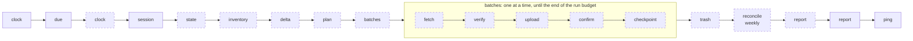

<p align="center">
  <a href="https://github.com/katoptra">
    <picture>
      <source media="(prefers-color-scheme: dark)" srcset="https://katoptra.org/brand/katoptra-mark-dark-224.png">
      
    </picture>
  </a>
</p>

<h1 align="center">dropbox</h1>

<p align="center">A nightly mirror of a Dropbox account into Proton Drive.</p>

<p align="center">
  <a href="https://github.com/katoptra/dropbox/actions/workflows/sync.yml"></a>
  <a href="LICENSE"></a>
  <a href="https://github.com/katoptra/dropbox/actions/workflows/sync.yml"></a>
</p>

This is a nightly mirror of a Dropbox account in one Proton Drive folder. If a run has more
work than its budget, it starts the next run through the chain. After each run, Proton Drive
has the files that Dropbox had at the time of the listing:

- A file that changed becomes a new revision in Proton.
- The mirror moves a file that is not in Dropbox to the trash of Proton.
- The mirror records a file only after the summary of the Proton CLI includes that file.

The only state that the mirror keeps from one run to the next is one SQLite database. It is
in a bucket, encrypted with age. Each run finds its start point in the state, and no input
tells a run where to start. Dropbox is the primary copy. The mirror writes no change from
Proton Drive back to Dropbox.

This repository is public, and it contains no account data. All the credentials and the
account identifiers are in one vault. A run uses the name of each value to get it.

The infrastructure modules in `src/migrator/` are from
[donphi/dropbox_proton](https://github.com/donphi/dropbox_proton), at commit `cfd0e57`, with
the MIT license. [LICENSE](LICENSE) keeps the copyright notice of that project. These are
the modules:

- The SQLite schema of the evidence tables
- The hasher, which reads a file one time to calculate all its hashes
- The module that writes files atomically
- The logger, which removes the secret values from its lines
- The path guards
- The two providers: one for the Dropbox API, and one for the `proton-drive` CLI.

The phases of the mirror and the Taskfile are from this repository.

## How to use

The files are in the destination folder in Proton Drive. Each file has its Dropbox path,
with the uppercase and lowercase letters that Dropbox gives.

- If you edit a file in Dropbox, the next nightly run makes a new revision of it in Proton.
- If you delete a file in Dropbox, the mirror moves it to the trash of Proton.
- A file can be too large for the disk of the runner. The report of the run counts such a
  file as oversized. You can upload it manually to its Dropbox path in Proton. The weekly
  walk does not move that file to the trash.

## How it works

Nightly, an external scheduler starts a GitHub Actions job. The job runs this pipeline in
the toolbox image of [katoptra/lib](https://github.com/katoptra/lib). Each solid box is a
verb of the toolbox or of the proton engine. Each dashed box is a step of this mirror: one
`python -m migrator <command>`.


```mermaid
flowchart LR
  clock --> due --> cp["clock"] --> session --> state --> inventory --> delta --> plan --> batches
  subgraph b["batches: one at a time, until the end of the run budget"]
    direction LR
    fetch --> verify --> upload --> confirm --> checkpoint
  end
  batches --> b --> trash --> reconcile["reconcile<br/>weekly"] --> rp["report"] --> report --> ping
  classDef own stroke-dasharray: 5 5
  class cp,state,inventory,delta,plan,batches,fetch,verify,upload,confirm,checkpoint,trash,reconcile,rp own
```

This mirror includes the toolbox and the proton engine, and `Taskfile.yml` gives the
pipeline. The Taskfile sets the sequence of the steps. The Python makes each decision, but
the `due` verb of the toolbox finds if a run does the Proton walk.

| Step | Function |
|---|---|
| `clock` | The `clock` of the toolbox writes the start epoch of the run to `.run/start.txt`, and it deletes the chain marker. Then this step reads the epoch and writes it to `.run/clock.json`. It removes all the files from `.run/staging`, and it deletes the report and the walked marker of the previous run |
| `session` | This is a verb of the proton engine. It gets the encrypted session of the Proton CLI from the bucket, and it puts the session in `.run/session` for each subsequent CLI call. It writes the digest of the session to `.run/session.sha`. After each CLI call, the migrator compares the session with that digest, and it sends a changed session back to the bucket |
| `state` | It gets the state database from the bucket, and it starts the row of the run. If the bucket has no state and no history, the run starts with an empty mirror. If the bucket has history but no state, the run stops, because it must not accept a missing state as an empty mirror |
| `inventory` | It makes a listing of Dropbox with the API, and it commits each page with its cursor. It records an entry with no content hash as non-downloadable, and the mirror does not download that entry. It makes each display path from the name of each folder above the file. The cause is that Dropbox does not always give a parent folder the same uppercase and lowercase letters |
| `delta` | It compares the inventory with `mirror_objects`: the path, the size and the content hash of each file. It rejects a listing that has less than 50% of the number of mirrored files. Thus, a short listing cannot become a trash list |
| `plan` | It rejects a tree that is larger than `ceiling_gb`. It also rejects a batch that the disk cannot contain in staging. It does not include the files that are larger than `max_file_gb`, and it counts them as oversized. It puts the other files in batches of `batch_gb` and `batch_files` |
| `batches` | It does the five steps that follow for each batch. It does not start a batch that can make the run longer than its budget. If it stops at the budget with batches to do, the run has no failure, and the chain starts the next run |
| `fetch` | It downloads the files of the batch from Dropbox into `.run/staging`, at their display paths. If a path is not in Dropbox after the listing, `fetch` counts it and does not download it |
| `verify` | It calculates the Dropbox content hash of each file in staging again, and it records the SHA-1 and the SHA-256. A different hash shows a file that changed after the listing. `verify` removes that file and counts it, and it does not record it |
| `upload` | One `proton-drive filesystem upload` call sends the staging tree, and the CLI writes a summary. The CLI does not upload a file if Proton has the same contents. Proton makes a new revision of a file that changed |
| `confirm` | The summary must include each verified file and each folder. Each failure in the summary must give the name of a file in the batch. `confirm` gives only those files the status `CONFIRM_FAILED`. It gives the other files the status `CONFIRMED` |
| `checkpoint` | It adds the confirmed rows to `mirror_objects`. Then it pushes the state to the bucket: first a dated copy, then the canonical key. It is always the last step of a batch. Thus, if the runner stops a run, the next run does a maximum of one batch again |
| `trash` | It operates only if all the planned batches are in Proton. If a topmost folder has no remaining file of the mirror, one `filesystem trash` call moves that folder to the trash, with its subtree. In a folder that has remaining files, `trash` gives the path of each deleted file to `filesystem trash`, 50 paths in each call. When a unit is complete, `trash` removes its rows from `mirror_objects`. It makes a checkpoint after each 50 units. At the end of the run budget, it stops, and the chain starts the next run for the remaining units |
| `reconcile` | It runs only if `due` wrote `.run/reconcile`: when the last completed walk is `RECONCILE_HOURS` (168, one week) or more before the run, or with `RECONCILE=true`. It does a full walk of Proton and compares it with `mirror_objects`. It removes the row of a file that Proton does not have, or has with a different size. The next run then uploads that file again. It moves a node that is not in Dropbox and not in the state to the trash. A walk that does not complete in one run removes no row and moves no node to the trash, and the next run continues it |
| `report` | It makes the step summary from the state only. It completes the run row, and it writes the chain marker. Its exit code gives the status of the run |

Without `--apply`, a step only makes a plan. These steps change data only with `--apply`:

- `batches`
- `trash`
- `reconcile`
- `report`
- `empty-trash`.

`task pipeline` gives `--apply`, and `task plan-pipeline` does not. For a command that
changes data, an exit code of 0 is not a sufficient indication that the change occurred.
Three layers of checks examine the mirror:

1. The summary of `upload` for each batch. `confirm` compares each item of the summary with
   the batch.
2. The block hashes on the server of Proton. Proton examines them when the CLI uploads a
   file, and this repository cannot change that check.
3. The weekly walk. It compares the listing of Proton with the state, independently of the
   data that the batches recorded.

The toolbox supplies the other parts of the run, from the image and the secrets to the
report and the ping. [lib's README](https://github.com/katoptra/lib#the-toolbox) has the
only description of these parts.

## Want your own?

### 1. Fork it

Fork [katoptra/dropbox](https://github.com/katoptra/dropbox). `Taskfile.yml` contains no
account data. [`config/mirror.toml`](config/mirror.toml) is the only file that sets how the
mirror operates, and its default values are correct for a GitHub runner. The account data is
in the environment, and all of it is from `op.env`.

### 2. Storage

The bucket contains the state and the session. It contains no file of the mirrored tree.

```
.state/state.sqlite.xz.age                     the state: evidence tables, mirror_objects, runs, batches, deletions
.state/history/<epoch>-<label>.sqlite.xz.age   one copy per checkpoint; label is the batch number, trash or trash-<folders>, reconcile or report
.state/session.tar.age                         the Proton CLI session; no history, a stale copy cannot be restored
.state/reconciled                              the start epoch of the run that last completed a Proton walk, plain text
```

| Item | Function |
|---|---|
| An R2 bucket, or a different S3-compatible bucket | It contains the state and the session. |
| An API token with Object Read & Write, for that bucket only | It gives the `r2` values in step 3. |
| A lifecycle rule that deletes the objects in `.state/history/` after 7 days | The bucket has no object versioning. The dated copies are the rollback. |

The state contains the name of each mirrored path. Thus, the mirror encrypts the state.
[lib, Storage](https://github.com/katoptra/lib#storage) gives the keys that the toolbox and
the engines keep in a bucket.

### 3. Secrets

A run gets twelve values from one vault item, `dropbox`. The item has one section for each
service:

| Section | Field | Value | The run gets it as |
|---|---|---|---|
| `dropbox` | `app_key`, `app_secret` | The scoped app from step 4 | `MIRROR_DROPBOX_APP_KEY`, `MIRROR_DROPBOX_APP_SECRET` |
| `dropbox` | `refresh_token` | The permanent token of the app | `MIRROR_DROPBOX_REFRESH_TOKEN` |
| `dropbox` | `account_id` | The `dbid:...` of the account that the run must read | `MIRROR_DROPBOX_ACCOUNT_ID` |
| `proton` | `destination` | The CLI path of the folder, `/my-files/Dropbox` | `MIRROR_PROTON_DESTINATION` |
| `proton` | `destination_uid` | The UID of that folder | `MIRROR_PROTON_DESTINATION_UID` |
| `r2` | `access_key_id`, `secret_access_key` | The token from step 2 | `AWS_ACCESS_KEY_ID`, `AWS_SECRET_ACCESS_KEY` |
| `r2` | `endpoint` | `https://<account-id>.r2.cloudflarestorage.com` | `AWS_ENDPOINT_URL_S3` |
| `r2` | `bucket` | The name of the bucket | `MIRROR_R2_BUCKET` |
| `age` | `identity` | An `AGE-SECRET-KEY-...` line from `age-keygen` | `MIRROR_AGE_IDENTITY` |
| `healthcheck` | `url` | A healthchecks.io ping URL. This value is optional. | `HEALTHCHECK_URL` |

1. Put the UUID of your vault in the references in [`op.env`](op.env).
2. Make a service account that can read that vault.
3. Put the token of the service account in the `OP_SERVICE_ACCOUNT_TOKEN` secret, on the
   organization or on the repository.

Each reference uses the UUID of the vault, not its name.
[lib, Secrets](https://github.com/katoptra/lib#secrets) tells how to find the UUID, and
gives the cause of this rule.

### 4. Dropbox and Proton

**The Dropbox app.** Do these steps:

1. At https://www.dropbox.com/developers/apps, make an app with Scoped access and Full
   Dropbox access.
2. Give the app only these permissions: `files.metadata.read` and `files.content.read`.
   Then the mirror cannot write to Dropbox.
3. Get a refresh token and the account ID with the commands that follow.

The refresh token is permanent, and it does not change. Each run makes sure that the token
is for this account ID before it uses a listing.

```sh
# 1. approve, with your key filled in, and copy the code:
#    https://www.dropbox.com/oauth2/authorize?client_id=APP_KEY&response_type=code&token_access_type=offline
curl https://api.dropboxapi.com/oauth2/token -d code=THE_CODE -d grant_type=authorization_code -u APP_KEY:APP_SECRET
# 2. the refresh_token from that response is the vault field; mint an access token from it and ask who you are:
curl https://api.dropboxapi.com/oauth2/token -d grant_type=refresh_token -d refresh_token=REFRESH_TOKEN -u APP_KEY:APP_SECRET
curl -X POST https://api.dropboxapi.com/2/users/get_current_account -H "Authorization: Bearer ACCESS_TOKEN"
# 3. the whole dbid:... string is account_id
```

**The session.** Only a sign-in in a browser can make a session for the Proton CLI. Make the
session one time, on a laptop. Then each run gets the encrypted session from the bucket.
[lib, The session](https://github.com/katoptra/lib#the-session) gives:

- The commands
- How to make the folder and find its UID
- `task session-seal -- .run/pd`.

Put the CLI path of the folder in the field `destination`. Put the `uid` of the folder from
the listing in the field `destination_uid`. This mirror has a session that no other mirror
uses.

### 5. Do the checks, run it, schedule it

1. Use a laptop with these tools:
   - go-task
   - The 1Password CLI
   - Docker or Apple `container`.
2. Run these commands:

   ```sh
   task run -- task offline   # pytest, ruff check and ruff format --check: in the image, offline
   task check                 # render each command of the pipeline in the image, then compare it with render.txt
   task plan                  # read-only, with the real account and bucket: the state, the Dropbox listing, the plan of a sync
   ```

3. Before the first run, pause the healthcheck
   ([lib, Monitoring](https://github.com/katoptra/lib#monitoring)).
4. In Actions, select the sync workflow.
5. Select **Run workflow**.

The first run finds no state and no history, and it uses the full tree as the delta. Then
the chain starts one run after the other, until the full tree is in Proton. Each run does
these steps:

- At the end of its budget, it starts no new batch.
- It makes a checkpoint of the batches that are in Proton.
- It starts the next run through the chain.

Each run pulls the image one time and makes one listing. Thus, the default budget is long:
335 minutes. The job timeout in `sync.yml` (`timeout-minutes`) is 355 minutes, and the limit
of GitHub for a job is six hours. The chain puts a tree of 200,000 files in Proton in
approximately 45 hours, with approximately sixteen runs.

No part of this repository starts a run. To start runs at set times, use one of these two
methods:

- Add a `schedule:` trigger to `.github/workflows/sync.yml`.
- Dispatch the workflow from an external scheduler. This mirror uses this method.

If a chained run is in progress, a scheduled run waits for it.

After three nightly runs with no failure, do a test of the mirror:

1. Edit one file in Dropbox.
2. Delete one different file in Dropbox.
3. After the next nightly run, make sure that Proton has the two changes.

## Operating it

`task` with no task name prints the menu. The menu puts the tasks in groups, one group for
each effect. Each task operates in the toolbox.

```sh
task plan                          # read-only: the state, the listing, and the files that a sync would move
task status                        # counts, and the figures of the last run, from the state in the bucket
task run -- task offline           # pytest, ruff check and ruff format --check
task sync                          # one run with a budget, the same as a run in Actions
task sync -- RUN_BUDGET_MIN=30     # a shorter budget
task sync -- RECONCILE=true        # the weekly Proton walk, in this run (true, false or auto)
task state-rollback                # a list of the dated history objects
task state-rollback -- <key>       # copy one of them over the canonical state
task session-seal -- .run/pd       # encrypt a laptop session of the Proton CLI into the bucket
task empty-trash                   # delete the trash of Proton permanently, after a prompt. No schedule starts it
gh workflow run sync.yml           # one run in Actions
```

Do not run `task sync`, `task plan` or `task empty-trash` on a laptop while an Actions run
can be in progress. If the laptop and the run use the session at the same time, a new login
can be necessary ([lib, The session](https://github.com/katoptra/lib#the-session)).

On a laptop, `task sync` does one run, and it does not start the next run. The next run
continues from the state in the bucket, on a laptop or in Actions.

**The run summary.** The mirror makes the step summary from the state only. Thus, on a
laptop, `task status` shows the same numbers as the Actions page. The summary contains only
counts, and no path name. It has these parts:

- The status of the mirror: the inventory, the mirrored files, the percent, the oversized
  files, and the remaining batches and runs
- This run: the budget that it used, the batches, and the files in each of these groups:
  fetched, vanished, mismatched, uploaded, skipped, confirmed and trashed
- The throughput
- The throttling of each provider
- The errors, for each class
- The last reconcile walk
- The status of each phase.

The text of each error is in the `events` table of the encrypted state. After
`task status`, you can read it in `.run/state.sqlite`. The mirror deletes the log rows after
seven days. The lifecycle rule of the history copies in the bucket has the same limit.

**The runbook.** If a run has a problem, find it in this list:

- **`login first` in the `events` table, or a failure at the first Proton call.** Proton
  does not accept the session. Do a new login on a laptop. Then run
  `task session-seal -- .run/pd`.
- **`configured Proton destination did not resolve to exactly one folder`, or
  `did not exactly match the listing`.** The folder is not directly in its parent folder, or
  its UID is different from the UID in the vault. Get the listing of the parent folder. Then
  correct the folder or the field.
- **`MIRROR_DROPBOX_ACCOUNT_ID ... must be a full dbid: identifier`.** The field is empty,
  or the reference in `op.env` is for an incorrect field.
- **`state object is missing but history exists`.** Run `task state-rollback`. Do not delete
  the history to make a run start with no state. With no state and no history, a run starts
  with an empty mirror.
- **The state looks incorrect after a run.** Run `task state-rollback -- <key>`. It puts a
  dated copy at the key of the canonical state. Then the CLI does not upload again a file
  that Proton has.
- **Files have the status `CONFIRM_FAILED`.** Proton did not accept these files. The cause
  is usually a temporary error on the server. The text of the error is in the state, at the
  batch item. The next run uploads the files again.
- **Each nightly run stops at the end of its budget.** Decrease `batch_files` or
  `batch_gb`. The throughput rows show which one. If a run made no checkpoint, it does not
  start the next run, and it stops with a failure.
- **Proton sends 429 errors.** The throttling table shows how many. Decrease `batch_gb`.
- **A weekly reconcile does not complete in one run.** This is usual for a large tree. The
  mirror records only a completed walk. Thus, the next run must also do a walk, and it
  continues the walk.
- **A flag has no effect.** Put the flags after the double dash. Before it, a flag sets a
  var on the host, and that var does not go into the container. `RECONCILE` accepts `true`,
  `false` or `auto`.
- **Proton does not show a new name that changes only uppercase and lowercase letters.**
  The key of each file is its path in lowercase letters. If the letters are important, give
  the file a different name in Dropbox. After the next run, give the file its name again.
- **Move the folder in Proton.** Move it to a different location in My files. Then change
  `destination` in the vault. The UID stays the same, and each run makes sure that the UID
  is correct.
- **Change the Dropbox account.** Put new values in the fields `refresh_token` and
  `account_id`. The next run moves the files of the previous account to the trash, and it
  uploads the new tree. To start with no data, do these steps before the next run:
  1. Remove all the files from the Proton folder.
  2. Delete the state and its history.
- **The run did not start.** This repository does not start runs. Examine the scheduler
  first ([katoptra/dispatch](https://github.com/katoptra/dispatch#when-something-goes-wrong)).
  Then use `gh workflow list --all`. For the sync workflow, it shows `active`, or
  `disabled_manually` if a person disabled it. Until you find the cause, start each run with
  `gh workflow run sync.yml`.

## Reference

**Configuration.** [`config/mirror.toml`](config/mirror.toml) is strict: it rejects a key
that it does not know. It contains no account identifier.

| Key | Function |
|---|---|
| `mirror.id` | The name of the mirror that the state records |
| `dropbox.root` | The subtree of Dropbox for the mirror. With an empty value, the mirror contains all of Dropbox |
| `dropbox.page_limit`, `minimum_call_interval_seconds` | The number of entries on a page of the listing, and the minimum interval between two Dropbox API calls. All the workers obey this one interval |
| `dropbox.download_workers` | The number of files that `fetch` downloads at the same time |
| `budget.batch_gb`, `batch_files` | The maximum GB and the maximum number of files in a batch. A file larger than `batch_gb` is a batch with only that file |
| `budget.max_file_gb` | The largest file that a plan puts in staging. The plan counts a larger file as oversized |
| `budget.run_budget_minutes` | The budget of the run, in minutes of clock time from its start. The timeout in `sync.yml` stays 20 minutes more than this value |
| `budget.ceiling_gb` | The plan rejects a Dropbox tree that is larger than this value |
| `budget.disk_headroom_gb` | The free disk that the runner must keep after it puts a batch in staging |
| `budget.listing_floor_ratio` | If the number of files in a listing is less than this value multiplied by the number of mirrored files, `delta` rejects the listing |
| `proton.walk_workers` | The number of folder listings at the same time in the reconcile walk. Each worker uses a copy of the session that no other worker uses |

The three account identifiers in `op.env` override these TOML keys:

- `dropbox.expected_account_id`
- `proton.destination`
- `proton.expected_destination_uid`.

These keys are for a private fork that keeps the identifiers in a file. With
`MIRROR_VERBOSE=1`, a run prints the full text of an error, not only its class.

**Where the data is.** The mirrored tree contains personal documents. During a batch, its
files are on the temporary disk of the runner and in memory, with no encryption. This is
necessary, because Dropbox sends plaintext, and the CLI encrypts each file on the client.
These items put limits on the risk:

- The runner is a VM for one job only. GitHub deletes it after the job.
- The logs and the step summary contain counts, and no names.
- No run uploads a workflow artifact.
- The state contains each path name. The mirror encrypts it with age before it pushes it to
  the bucket.
- The Dropbox credentials cannot write. The bucket token gives access to one bucket only.
  The service account can read one vault only.

Pull requests are welcome.

MIT licensed. Built by [Josh Vaughen](https://ijosh.com).
